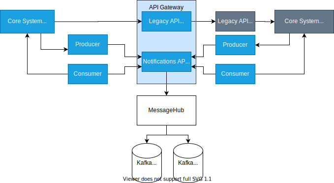

# Meesage Hub
This project to to demontrate the use of Kafka to syntronise data from a legacy system to a new system, with the ability to make API calls to the legacy system to retrive data that has been request in a search on the UI.

## Design



## Tools to testing. 

View the contents of the queue for `banana-topic` 
```c#
kafkacat -b localhost:9092 -t banana-topic -C
```